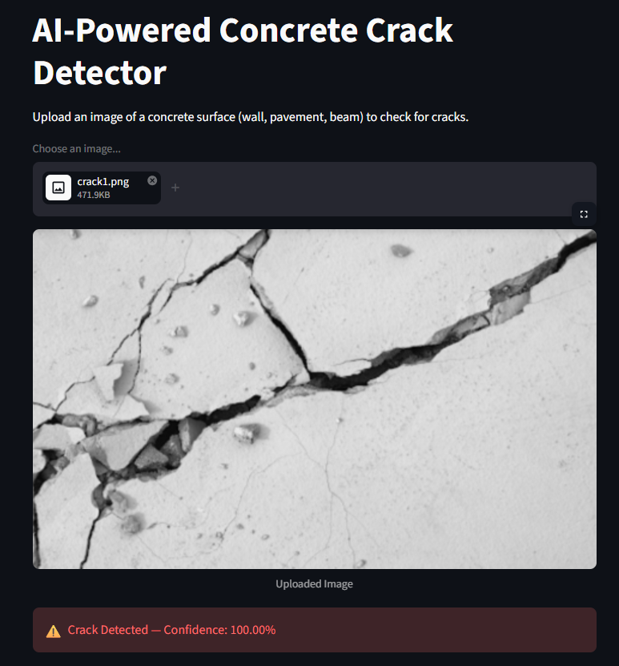
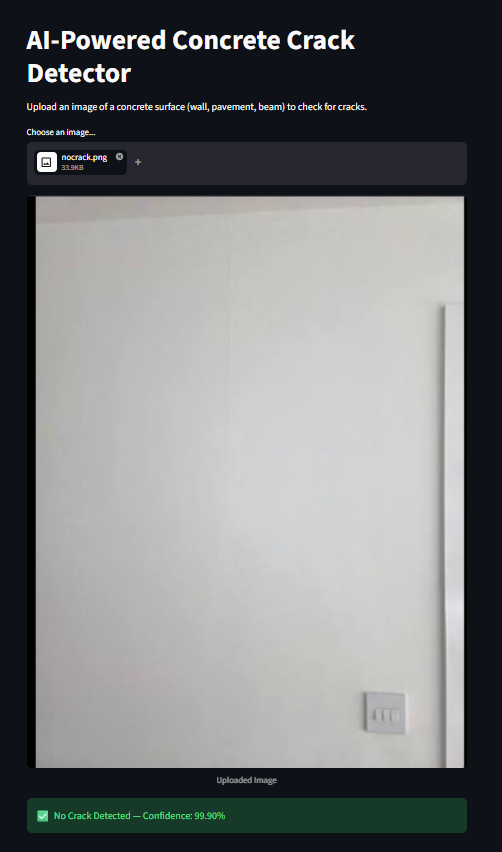

# AI-Powered Concrete Crack Detector

An AI-based web application that detects cracks on concrete surfaces using a deep learning model. The application allows users to upload an image of a concrete surface such as a wall, pavement, or beam and automatically predicts whether a crack is present.

## Live Demo

[Open the AI Concrete Crack Detector](https://concrete-crack-detector.streamlit.app/)

## Project Overview

Concrete cracks can be an early indication of structural deterioration and require timely inspection. Manual inspection of large concrete surfaces can be time-consuming and may depend heavily on the experience of the inspector.

This project provides a simple AI-assisted approach for preliminary crack detection. A user can upload an image through the web interface, and the trained deep learning model analyzes the image and provides a prediction along with its confidence.

## Features

* Upload concrete surface images in JPG, JPEG, or PNG format
* Automatic image preprocessing
* AI-based crack detection
* Confidence score for the prediction
* Simple and user-friendly web interface
* Supports concrete surfaces such as walls, pavements, and beams
* Deployed as a web application using Streamlit

## How It Works

The application follows the following workflow:

```text
User uploads image
        |
        v
Image converted to RGB
        |
        v
Image resized to 128 × 128 pixels
        |
        v
Pixel values normalized to 0–1
        |
        v
MobileNetV2-based trained model
        |
        v
Prediction generated
        |
        +----------------------+
        |                      |
        v                      v
Crack Detected          No Crack Detected
        |                      |
        v                      v
Confidence Score        Confidence Score
```

## Machine Learning Model

The application uses a trained **MobileNetV2-based deep learning model** using transfer learning.

The model is stored in:

```text
crack_detector.h5
```

The model was trained using more than **40,000 labeled concrete images**.

For prediction, uploaded images are:

1. Converted to RGB format
2. Resized to `128 × 128` pixels
3. Normalized by dividing pixel values by `255`
4. Passed to the trained neural network
5. Classified using a probability threshold of `0.5`

The prediction logic is:

```text
Prediction > 0.5  →  Crack Detected

Prediction ≤ 0.5  →  No Crack Detected
```

## Technologies Used

* **Python**
* **TensorFlow / Keras**
* **MobileNetV2**
* **NumPy**
* **Pillow**
* **Streamlit**

## Project Structure

```text
Concrete-Crack-Detector/
│
├── app.py
├── crack_detector.h5
├── requirements.txt
├── runtime.txt
├── .gitignore
└── README.md
```

### File Description

| File                | Description                  |
| ------------------- | ---------------------------- |
| `app.py`            | Main Streamlit application   |
| `crack_detector.h5` | Trained deep learning model  |
| `requirements.txt`  | Required Python packages     |
| `runtime.txt`       | Python runtime configuration |
| `.gitignore`        | Files excluded from Git      |
| `README.md`         | Project documentation        |

## Installation and Setup

### 1. Clone the Repository

```bash
git clone <your-github-repository-url>
cd Concrete-Crack-Detector
```

### 2. Create a Virtual Environment

```bash
python -m venv venv
```

Activate the environment on Windows:

```bash
venv\Scripts\activate
```

On macOS/Linux:

```bash
source venv/bin/activate
```

### 3. Install Dependencies

```bash
pip install -r requirements.txt
```

### 4. Run the Application

```bash
streamlit run app.py
```

The application will open in your browser.

## Requirements

The project uses the following Python libraries:

```text
streamlit
tensorflow
pillow
numpy
```

## Example Predictions

### Crack Detected

When an image containing visible concrete cracks is uploaded, the application displays:

```text
Crack Detected
Confidence: XX.XX%

```

### No Crack Detected

When an image without detectable cracks is uploaded, the application displays:

```text
No Crack Detected
Confidence: XX.XX%

```

## Deployment

The application is deployed using **Streamlit** and can be accessed through the live demo:

[Concrete Crack Detector](https://concrete-crack-detector.streamlit.app/)

To deploy your own version, connect the GitHub repository to Streamlit and select `app.py` as the main application file.

## Limitations

This application is intended as an AI-assisted preliminary inspection tool and should not replace professional structural inspection.

Prediction performance can be affected by:

* Image quality
* Lighting conditions
* Camera angle
* Surface texture
* Image resolution
* Dirt, stains, or other surface patterns
* Types of concrete cracks not sufficiently represented in the training data

For critical structural decisions, the prediction should be verified by a qualified civil or structural engineering professional.

## Future Improvements

Possible improvements to the project include:

* Crack severity classification
* Crack width estimation
* Crack length measurement
* Crack localization using object detection or segmentation
* Highlighting detected cracks directly on the uploaded image
* Integration with mobile cameras
* Larger and more diverse training datasets
* Improved model accuracy and validation
* Automated inspection reports
* Storage of inspection history and results

## Applications

The system can potentially assist with preliminary inspection of:

* Concrete buildings
* Bridges
* Roads and pavements
* Beams and columns
* Concrete walls
* Parking structures
* Other concrete infrastructure

